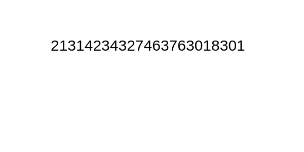
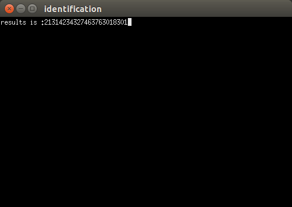
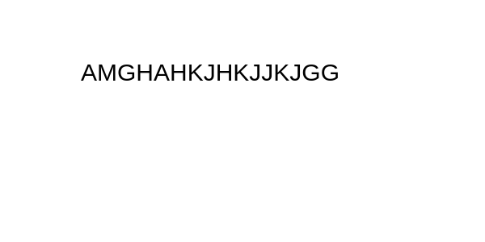
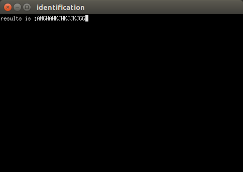
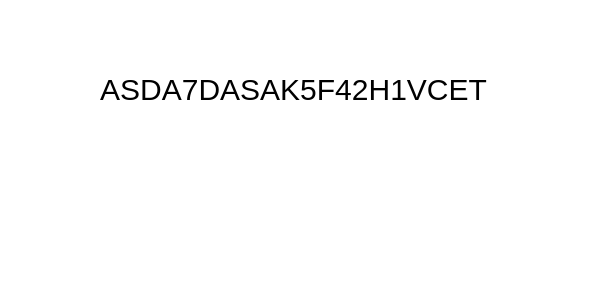
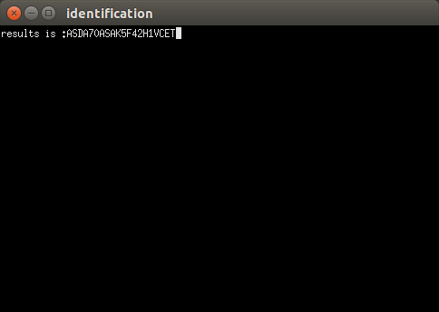

# characterRecognition
Recognize English character and digits in picture 
This repository contains 2 projects,generatedXMl is for obtain xml file,which stored classfication training data,then in project "identification",using xml file as input to create a k-NearestNeighbor model for character recognition purpose,and carry out recognition test.

##project generatorXml summary
1.read train_chars.png,a picture with many characters,the source data of training  
2.transfer this RGB picture into grey format 
3.make sure generate a grey picture with black background,for obtaining external contours of all characters 
4.train data,transverse all character contours,and generate normalised 30*20 pixel grey image,store in classfication.xml as a row,with 600 columns.Each row(only 1 column) in image.xml corresponding a row in classfication.xml,i.e. each row in classfication.xml represent a 30*20 pixel grey image,and thecorreponding character in this image is stored in image.xml. 

##project identification

